# 🎓 Moodle Assignment Fetcher

**Automatically fetch, organize, and manage your Moodle assignments across Gmail, Notion, and Todoist.**

A smart automation system that monitors your Gmail for Moodle assignment emails, extracts assignment details, and syncs them to your favorite productivity tools.

---

## 🤔 What is this?

Ever tired of manually tracking assignments from Moodle email notifications? This tool:

1. **📧 Monitors your Gmail** for Moodle assignment emails
2. **🧠 Intelligently parses** assignment details (title, due date, course)
3. **📝 Stores assignments** locally in organized JSON files
4. **🔄 Syncs to Notion** database for visual management
5. **✅ Syncs to Todoist** for task management and reminders
6. **🗂️ Archives completed** assignments automatically

**Perfect for students who want to automate their assignment workflow!**

---

## 🚀 Quick Start

### 1. Setup (5 minutes)

```bash
# Clone and navigate
git clone <your-repo>
cd automate

# Install dependencies
python3 -m venv venv
source venv/bin/activate
pip install -r requirements.txt

# Configure credentials (see Setup Guide below)
cp .env.example .env
# Edit .env with your credentials
```

### 2. Test Everything

```bash
# Test all connections
./deployment/run.sh test
```

### 3. Fetch Assignments

```bash
# Get assignments from last 7 days
./deployment/run.sh check

# Sync to Notion and Todoist
./deployment/run.sh notion
```

**That's it! Your assignments are now organized.** 🎉

---

## 📋 Setup Guide

### Gmail Setup (Required)

1. **Enable 2-Factor Authentication** on your Google account
2. **Generate App Password**:
   - Go to [Google Account Settings](https://myaccount.google.com/)
   - Security → 2-Step Verification → App passwords
   - Generate password for "Mail"
3. **Add to `.env`**:
   ```bash
   GMAIL_USER=your.email@gmail.com
   GMAIL_PASSWORD=your_app_password_here
   ```

### Notion Setup (Optional but Recommended)

1. **Create Integration**: Go to [Notion Integrations](https://www.notion.so/my-integrations)
2. **Create Database**: Add a new database with these columns:
   - Title (Title), Course (Text), Due Date (Date), Status (Select)
3. **Get Database ID**: From URL or use our setup script
4. **Add to `.env`**:
   ```bash
   NOTION_TOKEN=your_integration_token
   NOTION_DATABASE_ID=your_database_id
   ```

[📓 **Detailed Notion Guide**](documentation/notion-guide.md)

### Todoist Setup (Optional)

1. **Get API Token**: Go to [Todoist Settings](https://todoist.com/prefs/integrations)
2. **Add to `.env`**:
   ```bash
   TODOIST_API_TOKEN=your_token_here
   ```

[📋 **Detailed Todoist Guide**](documentation/todoist-guide.md)

---

## 🎯 Basic Usage

### Daily Commands

```bash
# Check for new assignments
./deployment/run.sh check

# Check + sync to all platforms
./deployment/run.sh notion

# View assignment status
./deployment/run.sh status

# View recent logs
./deployment/run.sh logs
```

### Manual Commands

```bash
# Test connections
python run_fetcher.py --test

# Fetch from last 14 days
python run_fetcher.py --days 14

# Sync to Notion only
python run_fetcher.py --notion

# Sync to Todoist only  
python run_fetcher.py --todoist

# Sync to both
python run_fetcher.py --notion --todoist

# Verbose output for debugging
python run_fetcher.py --verbose
```

### Debug & Management Commands

```bash
# Status and analysis
./deployment/run.sh status              # Detailed assignment status report
./deployment/run.sh duplicates          # Show duplicate detection analysis
./deployment/run.sh archive-stats       # Show archive statistics

# Selective deletion (⚠️ Use with caution!)
./deployment/run.sh delete-all          # Delete from both Notion and Todoist (local preserved)
./deployment/run.sh delete-all notion   # Delete only from Notion (local preserved)
./deployment/run.sh delete-all todoist  # Delete only from Todoist (local preserved)
./deployment/run.sh delete-all both --include-local     # Delete from both + local database
./deployment/run.sh delete-all notion --include-local   # Delete from Notion + local database
./deployment/run.sh delete-all todoist --include-local  # Delete from Todoist + local database

# Note: Deletion commands never touch your Gmail emails, only local storage and synced platforms
```

---

## 📊 Features

| Feature | Description | Status |
|---------|-------------|--------|
| **📧 Gmail Integration** | Fetch assignment emails automatically | ✅ Ready |
| **🧠 Smart Parsing** | Extract title, course, due date from emails | ✅ Ready |
| **📝 Local Storage** | Store assignments in organized JSON files | ✅ Ready |
| **🔄 Notion Sync** | Two-way sync with Notion database | ✅ Ready |
| **✅ Todoist Sync** | Sync assignments as tasks with reminders | ✅ Ready |
| **🔍 Duplicate Detection** | Prevent duplicate assignments | ✅ Ready |
| **🗂️ Auto-Archiving** | Archive completed assignments | ✅ Ready |
| **📱 Mobile Access** | Access via Notion/Todoist mobile apps | ✅ Ready |
| **⏰ Automation** | Cron/systemd scheduling | ✅ Ready |

---

## 🏗️ Project Structure

```
📦 automate/
├── 🎯 Core Scripts
│   ├── run_fetcher.py           # Main entry point
│   ├── moodle_fetcher.py        # Gmail + parsing logic
│   ├── notion_integration.py    # Notion API integration  
│   ├── todoist_integration.py   # Todoist API integration
│   └── assignment_archive.py    # Archive management
│
├── 📂 Data & Logs
│   ├── data/assignments.json    # Your assignments
│   ├── data/assignments.md      # Readable summary
│   └── logs/moodle_fetcher.log  # System logs
│
├── 🧪 Testing
│   ├── tests/setup_notion_db.py # Setup Notion database
│   ├── tests/test_*.py          # Various test suites
│   └── tests/test_notion_stress.py # Performance tests
│
├── 🚀 Deployment  
│   ├── deployment/run.sh        # Quick command runner
│   ├── deployment/daily_check.sh # Cron script
│   └── deployment/*.service     # Systemd configs
│
└── 📋 Documentation
    ├── documentation/notion-guide.md   # Notion setup
    ├── documentation/todoist-guide.md  # Todoist setup
    └── documentation/testing-guide.md  # Testing & debug
```

---

## 🔧 Advanced Usage

### Automation (Set & Forget)

```bash
# Check for assignments every 6 hours
echo "0 */6 * * * cd /path/to/automate && ./deployment/run.sh check" | crontab -

# Daily comprehensive sync at 8 AM
echo "0 8 * * * cd /path/to/automate && ./deployment/run.sh notion" | crontab -
```

### Bulk Operations

```bash
# Re-sync everything from last 30 days
rm data/assignments.json
python run_fetcher.py --days 30 --notion --todoist

# Export assignments for backup
cp data/assignments.json backups/assignments_$(date +%Y%m%d).json
```

### Custom Scripts

```python
# Custom assignment processing
from moodle_fetcher import MoodleEmailFetcher
from notion_integration import NotionIntegration

fetcher = MoodleEmailFetcher()
notion = NotionIntegration()

# Get assignments from last 3 days
assignments = fetcher.fetch_assignments(days=3)
print(f"Found {len(assignments)} assignments")

# Sync to Notion
if notion.enabled:
    synced = notion.sync_assignments(assignments)
    print(f"Synced {synced} to Notion")
```

---

## 🚨 Troubleshooting

### Common Issues

**❌ "Gmail authentication failed"**
```bash
# Check your app password
python -c "
import os
from dotenv import load_dotenv
load_dotenv()
print('Gmail user:', os.getenv('GMAIL_USER'))
print('Password set:', bool(os.getenv('GMAIL_PASSWORD')))
"
```

**❌ "No assignments found"**
```bash
# Check email search
python run_fetcher.py --test --verbose
```

**❌ "Notion/Todoist not working"**
```bash
# Test individual connections
./deployment/run.sh test
```

### Debug Mode

```bash
# Enable verbose logging
export LOG_LEVEL=DEBUG
python run_fetcher.py --verbose

# Check logs
tail -f logs/moodle_fetcher.log
```

### Get Help

- 📓 [Notion Integration Guide](documentation/notion-guide.md)
- 📋 [Todoist Integration Guide](documentation/todoist-guide.md)  
- 🧪 [Testing & Debug Guide](documentation/testing-guide.md)

---

## 🎯 Workflow Example

Here's how a typical assignment flows through the system:

```mermaid
graph TD
    A[📧 Moodle sends email] --> B[📬 Gmail receives email]
    B --> C[🔍 System fetches email]
    C --> D[🧠 Parse assignment details]
    D --> E[💾 Save to assignments.json]
    E --> F[📝 Sync to Notion database]
    F --> G[✅ Create Todoist task]
    G --> H[📱 Access on mobile]
    H --> I[✅ Mark as completed]
    I --> J[🗂️ Auto-archive after 30 days]
```



## 💡 Use Cases

- **🎓 Students**: Automatically track all course assignments
- **👥 Study Groups**: Share assignment database with team
- **📅 Planning**: Visualize assignment timeline in Notion
- **⏰ Reminders**: Get Todoist notifications for due dates
- **📊 Analytics**: Track completion rates and workload

---

## 🛠️ Development

### Running Tests

```bash
# Test all components
python -m pytest tests/ -v

# Test specific integration
python tests/test_notion_sync.py

# Stress test performance
python tests/test_notion_stress.py
```

### Contributing

1. Fork the repository
2. Create a feature branch
3. Add tests for new functionality
4. Submit a pull request

---

## 📞 Support

### Quick Commands

```bash
./deployment/run.sh          # Show all available commands
./deployment/run.sh test     # Test all connections  
./deployment/run.sh status   # Check assignment counts
./deployment/run.sh logs     # View recent activity
```

### Documentation

- 🏠 **README** (this file) - Overview and quick start
- 📓 **[Notion Guide](documentation/notion-guide.md)** - Detailed Notion setup
- 📋 **[Todoist Guide](documentation/todoist-guide.md)** - Detailed Todoist setup
- 🧪 **[Testing Guide](documentation/testing-guide.md)** - Testing and debugging

---

## 🎉 Success Stories

> *"Went from manually tracking 15+ assignments across 6 courses to having everything automatically organized in Notion. Game changer!"* - CS Student

> *"The Todoist integration means I never miss a deadline. The system just works."* - Engineering Student

> *"Set it up once, been running for 3 months without any issues. Perfect automation."* - Graduate Student

---

**Ready to automate your assignment workflow? Start with the [Quick Start](#-quick-start) above!** 🚀

---

<sub>Built with ❤️ for students who want to focus on learning, not assignment tracking.</sub>