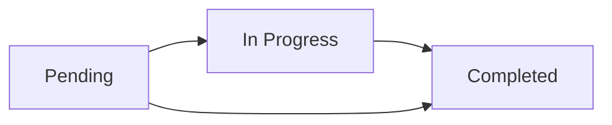
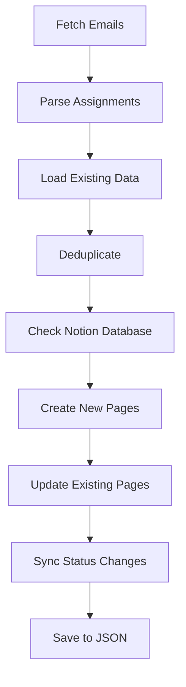

# 📓 Notion Integration Guide

Complete guide for setting up and using Notion integration with the Moodle Assignment Fetcher.

## 🚀 Quick Start

```bash
# Test Notion connection
./deployment/run.sh test

# Sync assignments to Notion
python run_fetcher.py --notion --verbose
```

## 📋 Table of Contents

- [Setup](#-setup)
- [Database Configuration](#-database-configuration)
- [Basic Commands](#-basic-commands)
- [Advanced Usage](#-advanced-usage)
- [Database Schema](#-database-schema)
- [Troubleshooting](#-troubleshooting)
- [API Reference](#-api-reference)

## 🛠️ Setup

### 1. Create Notion Integration

1. Go to [Notion Integrations](https://www.notion.so/my-integrations)
2. Click "New integration"
3. Give it a name (e.g., "Moodle Fetcher")
4. Copy the "Internal Integration Token"

### 2. Create Assignment Database

1. Create a new page in Notion
2. Add a database with these properties:
   - **Title** (Title)
   - **Course** (Text)
   - **Due Date** (Date)
   - **Status** (Select: Pending, In Progress, Completed)
   - **Course Code** (Text)
   - **Added Date** (Date)
   - **Email ID** (Text)
   - **Raw Title** (Text)

### 3. Share Database with Integration

1. Click "Share" on your database page
2. Click "Invite" 
3. Find your integration and click "Invite"

### 4. Configure Environment

Add to your `.env` file:

```bash
NOTION_TOKEN=your_integration_token_here
NOTION_DATABASE_ID=your_database_id_here
```

### 5. Test Connection

```bash
# Quick connection test
./deployment/run.sh test

# Or manual test
python tests/setup_notion_db.py
```

## 🗃️ Database Configuration

### Required Properties

Your Notion database **must** have these properties:

| Property Name | Type | Description | Required |
|---------------|------|-------------|----------|
| Title | Title | Assignment title | ✅ |
| Course | Text | Course name | ✅ |
| Due Date | Date | Assignment due date | ✅ |
| Status | Select | Assignment status | ✅ |
| Course Code | Text | Course code (e.g., CS101) | ✅ |
| Added Date | Date | When assignment was added | ✅ |
| Email ID | Text | Unique email identifier | ✅ |
| Raw Title | Text | Original email title | ❌ |

### Status Options

Configure your Status select property with these options:
- **Pending** (default for new assignments)
- **In Progress** (for work-in-progress)
- **Completed** (for finished assignments)

### Database ID

To find your database ID:

```bash
# From the database URL
https://notion.so/your-workspace/DATABASE_ID?v=...
                                ^^^^^^^^^
                             This is your Database ID

# Or use the setup script
python tests/setup_notion_db.py
```

## 🎯 Basic Commands

### Sync All Assignments

```bash
# Sync all assignments from last 7 days
python run_fetcher.py --notion

# Sync with verbose output
python run_fetcher.py --notion --verbose

# Sync specific number of days
python run_fetcher.py --days 14 --notion
```

### Combo Operations

```bash
# Sync to both Notion and Todoist
python run_fetcher.py --notion --todoist

# Full sync with all integrations
./deployment/run.sh notion
```

### Test Operations

```bash
# Test Notion connection only
python run_fetcher.py --test

# Run Notion stress tests
python tests/test_notion_stress.py

# Test database setup
python tests/setup_notion_db.py
```

## 🔧 Advanced Usage

### Manual Sync Script

```python
#!/usr/bin/env python3
from notion_integration import NotionIntegration
import json

# Load assignments
with open('data/assignments.json', 'r') as f:
    assignments = json.load(f)

# Sync to Notion
notion = NotionIntegration()
if notion.enabled:
    synced = notion.sync_assignments(assignments)
    print(f"Synced {synced} assignments to Notion")
```

### Custom Database Queries

```python
from notion_integration import NotionIntegration

notion = NotionIntegration()

# Get all assignments from Notion
all_assignments = notion.get_all_assignments_from_notion()
print(f"Found {len(all_assignments)} assignments in Notion")

# Filter by status
pending = [a for a in all_assignments if a.get('status') == 'Pending']
print(f"Pending assignments: {len(pending)}")
```

### Bulk Status Updates

```python
# Update multiple assignments at once
notion = NotionIntegration()
assignments_to_update = [
    {"email_id": "some_id_1", "status": "Completed"},
    {"email_id": "some_id_2", "status": "In Progress"}
]

for assignment in assignments_to_update:
    notion.update_assignment_status(assignment["email_id"], assignment["status"])
```

## 📊 Database Schema

### Assignment Object Structure

```python
{
    "title": "ACTIVITY 1 - USER STORY",
    "title_normalized": "activity 1 - user story", 
    "course": "HCI - HUMAN COMPUTER INTERACTION (III-ACSAD)",
    "course_code": "HCI",
    "due_date": "2025-09-05",
    "raw_title": "Assignment ACTIVITY 1 - USER STORY has been changed",
    "source": "email",
    "email_id": "unique_email_id_12345",
    "email_date": "2025-08-07",
    "last_updated": "2025-08-07 14:30:22",
    "status": "Pending",
    "added_date": "2025-08-07"
}
```

### Notion Database Properties Mapping

```python
Assignment Field → Notion Property
─────────────────────────────────
title            → Title (title)
course           → Course (rich_text)
due_date         → Due Date (date)
status           → Status (select)
course_code      → Course Code (rich_text)
added_date       → Added Date (date)
email_id         → Email ID (rich_text)
raw_title        → Raw Title (rich_text)
```

### Status Workflow



## 🚨 Troubleshooting

### Common Issues

#### ❌ "Notion integration not enabled"

**Cause:** Missing or invalid token/database ID

**Solution:**
```bash
# Check your .env file
cat .env | grep NOTION

# Verify token works
curl -X GET https://api.notion.com/v1/databases/YOUR_DB_ID \
  -H "Authorization: Bearer YOUR_TOKEN" \
  -H "Notion-Version: 2022-06-28"
```

#### ❌ "Database not found or not accessible"

**Cause:** Integration not invited to database

**Solution:**
1. Go to your Notion database
2. Click "Share" → "Invite"
3. Add your integration
4. Test again: `python run_fetcher.py --test`

#### ❌ "Property XYZ not found"

**Cause:** Database missing required properties

**Solution:**
```bash
# Use setup script to check/create properties
python tests/setup_notion_db.py

# Or manually add missing properties in Notion
```

#### ❌ "Rate limit exceeded"

**Cause:** Too many API calls

**Solution:**
```bash
# Wait and retry (Notion has generous limits)
sleep 30
python run_fetcher.py --notion
```

#### ❌ "Validation failed for property"

**Cause:** Invalid data type for property

**Solution:**
```bash
# Check property types in Notion match schema
# Run with verbose to see which property failed
python run_fetcher.py --notion --verbose
```

### Debug Mode

```bash
# Enable debug logging
export LOG_LEVEL=DEBUG
python run_fetcher.py --notion --verbose

# Check logs
tail -f logs/moodle_fetcher.log | grep -i notion
```

### Database Validation

```python
# Validate database schema
from notion_integration import NotionIntegration

notion = NotionIntegration()
try:
    # This will validate all required properties exist
    assignments = notion.get_all_assignments_from_notion()
    print("✅ Database schema is valid")
except Exception as e:
    print(f"❌ Database validation failed: {e}")
```

## 📚 API Reference

### NotionIntegration Class

```python
class NotionIntegration:
    def __init__(self)
    def sync_assignments(assignments: List[Dict]) -> int
    def get_all_assignments_from_notion() -> List[Dict]
    def create_assignment_page(assignment: Dict) -> str
    def update_assignment_status(email_id: str, status: str) -> bool
    def find_assignment_by_email_id(email_id: str) -> Optional[Dict]
```

### Key Methods

#### `sync_assignments(assignments)`
- **Purpose:** Sync assignment list to Notion database
- **Parameters:** List of assignment dictionaries
- **Returns:** Number of assignments synced
- **Example:**
```python
synced_count = notion.sync_assignments(assignments)
```

#### `get_all_assignments_from_notion()`
- **Purpose:** Retrieve all assignments from Notion database
- **Returns:** List of assignment dictionaries
- **Example:**
```python
assignments = notion.get_all_assignments_from_notion()
```

#### `update_assignment_status(email_id, status)`
- **Purpose:** Update assignment status in Notion
- **Parameters:** Email ID and new status
- **Returns:** Boolean success status
- **Example:**
```python
success = notion.update_assignment_status("email_123", "Completed")
```

### Error Handling

```python
try:
    notion = NotionIntegration()
    if not notion.enabled:
        print("Notion not configured")
        exit(1)
    
    result = notion.sync_assignments(assignments)
    print(f"Success: {result} assignments synced")
    
except Exception as e:
    print(f"Error: {e}")
    # Check logs for details
```

## 🎯 Best Practices

### 1. Database Organization

```bash
# Use filters and views in Notion for better organization
# Create views for:
# - Assignments due this week
# - Pending assignments
# - Assignments by course
# - Completed assignments
```

### 2. Regular Backups

```python
# Backup Notion data regularly
from notion_integration import NotionIntegration
import json
from datetime import datetime

notion = NotionIntegration()
assignments = notion.get_all_assignments_from_notion()

backup_file = f"notion_backup_{datetime.now().strftime('%Y%m%d_%H%M%S')}.json"
with open(backup_file, 'w') as f:
    json.dump(assignments, f, indent=2)
```

### 3. Monitor Sync Performance

```bash
# Check sync duration and success rates
grep "Notion sync" logs/moodle_fetcher.log | tail -10

# Monitor API response times
grep -E "Notion.*took" logs/moodle_fetcher.log
```

### 4. Database Maintenance

```bash
# Periodically check for duplicate entries
python -c "
from notion_integration import NotionIntegration
assignments = NotionIntegration().get_all_assignments_from_notion()
emails = [a['email_id'] for a in assignments]
duplicates = set([e for e in emails if emails.count(e) > 1])
print(f'Duplicates found: {len(duplicates)}')
"
```

## 🧪 Testing & Validation

### Database Setup Test

```bash
# Validate database configuration
python tests/setup_notion_db.py
```

### Stress Testing

```bash
# Run comprehensive stress tests
python tests/test_notion_stress.py

# Test with large datasets
python run_fetcher.py --days 30 --notion --verbose
```

### Sync Validation

```bash
# Compare local data with Notion
python tests/test_notion_sync.py
```

## 📊 Monitoring & Analytics

### Sync Statistics

```bash
# Check sync success rate
grep "assignments synced to Notion" logs/moodle_fetcher.log | tail -20

# View error patterns
grep "ERROR.*notion" logs/moodle_fetcher.log
```

### Performance Metrics

```bash
# Monitor sync duration
grep -E "Notion sync.*took" logs/moodle_fetcher.log

# Check API call patterns
grep -E "Notion API.*ms" logs/moodle_fetcher.log
```

### Data Integrity Checks

```python
# Verify data consistency
from notion_integration import NotionIntegration
import json

# Load local data
with open('data/assignments.json', 'r') as f:
    local_assignments = json.load(f)

# Get Notion data
notion = NotionIntegration()
notion_assignments = notion.get_all_assignments_from_notion()

print(f"Local: {len(local_assignments)} assignments")
print(f"Notion: {len(notion_assignments)} assignments")

# Check for missing assignments
local_ids = {a['email_id'] for a in local_assignments}
notion_ids = {a['email_id'] for a in notion_assignments}

missing_in_notion = local_ids - notion_ids
missing_locally = notion_ids - local_ids

if missing_in_notion:
    print(f"Missing in Notion: {len(missing_in_notion)}")
if missing_locally:
    print(f"Missing locally: {len(missing_locally)}")
```

## 🔄 Integration Workflow



## 💡 Advanced Features

### Custom Views in Notion

Create these useful views in your database:

1. **Due This Week**
   - Filter: Due Date is within 1 week
   - Sort: Due Date (ascending)

2. **By Status**
   - Group by: Status
   - Sort: Due Date (ascending)

3. **By Course**
   - Group by: Course Code
   - Sort: Due Date (ascending)

4. **Recently Added**
   - Filter: Added Date is within 3 days
   - Sort: Added Date (descending)

### Automation Ideas

```python
# Auto-mark overdue assignments
from datetime import datetime, date

notion = NotionIntegration()
assignments = notion.get_all_assignments_from_notion()

today = date.today()
for assignment in assignments:
    due_date = datetime.strptime(assignment['due_date'], '%Y-%m-%d').date()
    if due_date < today and assignment['status'] == 'Pending':
        notion.update_assignment_status(assignment['email_id'], 'Overdue')
```

## 📞 Support

### Quick Help Commands

```bash
# Show all available commands
./deployment/run.sh

# Test Notion integration
./deployment/run.sh test

# Full sync with Notion
./deployment/run.sh notion
```

### Common Command Patterns

```bash
# Daily sync routine
./deployment/run.sh notion && ./deployment/run.sh status

# Weekly comprehensive sync
python run_fetcher.py --days 7 --notion --verbose

# Emergency resync with Notion
rm data/assignments.json && python run_fetcher.py --notion
```

---

> 💡 **Pro Tip:** Use Notion's powerful filtering and sorting to organize your assignments

> ⚡ **Quick Fix:** Most sync issues resolve by checking database permissions and property names

> 📱 **Mobile:** Access your assignment database on mobile via Notion app for anywhere access

> 🔗 **Integration:** Combine with Todoist for the ultimate assignment management workflow
