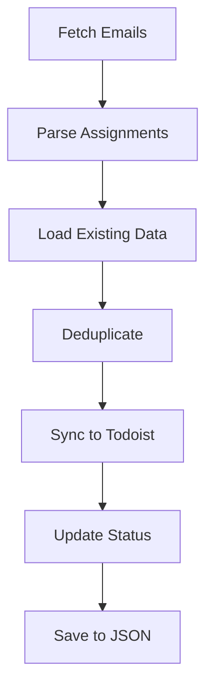

# 📋 Todoist Integration Guide

Complete guide for setting up and using Todoist integration with the Moodle Assignment Fetcher.

## 🚀 Quick Start

```bash
# Test Todoist connection
./deployment/run.sh test

# Sync assignments to Todoist
python run_fetcher.py --todoist --verbose
```

## 📋 Table of Contents

- [Setup](#-setup)
- [Configuration](#-configuration) 
- [Basic Commands](#-basic-commands)
- [Advanced Usage](#-advanced-usage)
- [Troubleshooting](#-troubleshooting)
- [API Reference](#-api-reference)

## 🛠️ Setup

### 1. Get Todoist API Token

1. Go to [Todoist Settings](https://todoist.com/prefs/integrations)
2. Copy your API token
3. Add to your `.env` file:

```bash
TODOIST_API_TOKEN=your_token_here
```

### 2. Configure Project (Optional)

```bash
# Set specific project name in .env (default: "Assignments")
TODOIST_PROJECT_NAME=University Assignments
```

### 3. Test Connection

```bash
# Quick connection test
./deployment/run.sh test

# Or manual test
python -c "from todoist_integration import TodoistIntegration; t = TodoistIntegration(); print('✅ Connected!' if t.enabled else '❌ Failed')"
```

## ⚙️ Configuration

### Environment Variables

| Variable | Description | Default | Required |
|----------|-------------|---------|----------|
| `TODOIST_API_TOKEN` | Your Todoist API token | - | ✅ |
| `TODOIST_PROJECT_NAME` | Project name for assignments | "Assignments" | ❌ |

### Assignment Mapping

```python
# How assignments map to Todoist tasks
Assignment Field → Todoist Field
─────────────────────────────────
title            → content (task name)
due_date         → due_date
course           → description
status           → completed (true/false)
```

## 🎯 Basic Commands

### Sync All Assignments

```bash
# Sync all assignments from last 7 days
python run_fetcher.py --todoist

# Sync with verbose output
python run_fetcher.py --todoist --verbose

# Sync specific number of days
python run_fetcher.py --days 14 --todoist
```

### Test Operations

```bash
# Test Todoist connection only
python run_fetcher.py --test

# Test with Todoist sync
python tests/test_todoist.py
```

### Status Management

```bash
# Check assignment status
./deployment/run.sh status

# View recent logs
./deployment/run.sh logs
```

## 🔧 Advanced Usage

### Manual Sync Script

```python
#!/usr/bin/env python3
from todoist_integration import TodoistIntegration
import json

# Load assignments
with open('data/assignments.json', 'r') as f:
    assignments = json.load(f)

# Sync to Todoist
todoist = TodoistIntegration()
if todoist.enabled:
    synced = todoist.sync_assignments(assignments)
    print(f"Synced {synced} assignments")
```

### Custom Project Setup

```python
from todoist_integration import TodoistIntegration

# Initialize with custom project
todoist = TodoistIntegration()
project_id = todoist.get_or_create_project("My Custom Project")
print(f"Project ID: {project_id}")
```

### Bulk Operations

```bash
# Sync large number of assignments
python run_fetcher.py --days 30 --todoist --verbose

# Force re-sync all assignments
rm data/assignments.json
python run_fetcher.py --todoist
```

## 🚨 Troubleshooting

### Common Issues

#### ❌ "Todoist integration not enabled"

**Cause:** Missing or invalid API token

**Solution:**
```bash
# Check your .env file
cat .env | grep TODOIST

# Verify token works
curl -X GET https://api.todoist.com/rest/v2/projects \
  -H "Authorization: Bearer YOUR_TOKEN"
```

#### ❌ "Project not found"

**Cause:** Project name doesn't exist in Todoist

**Solution:**
```bash
# Let the system create it automatically
python run_fetcher.py --todoist

# Or create manually in Todoist app first
```

#### ❌ "Rate limit exceeded"

**Cause:** Too many API calls

**Solution:**
```bash
# Wait 1 minute, then retry
sleep 60
python run_fetcher.py --todoist
```

#### ❌ "Duplicate tasks created"

**Cause:** Assignment matching failed

**Solution:**
```bash
# Clear data and resync
rm data/assignments.json
python run_fetcher.py --todoist
```

### Debug Mode

```bash
# Enable debug logging
export LOG_LEVEL=DEBUG
python run_fetcher.py --todoist --verbose

# Check logs
tail -f logs/moodle_fetcher.log
```

### API Call Limits

```python
# Check API usage (manual script)
from todoist_integration import TodoistIntegration
import requests

todoist = TodoistIntegration()
response = requests.get(
    "https://api.todoist.com/rest/v2/projects",
    headers={"Authorization": f"Bearer {todoist.api_token}"}
)
print(f"Rate limit remaining: {response.headers.get('X-RateLimit-Remaining', 'Unknown')}")
```

## 📚 API Reference

### TodoistIntegration Class

```python
class TodoistIntegration:
    def __init__(self)
    def sync_assignments(assignments: List[Dict]) -> int
    def get_or_create_project(name: str) -> str
    def create_task(assignment: Dict) -> bool
    def update_task_status(task_id: str, completed: bool) -> bool
    def get_all_tasks() -> List[Dict]
```

### Key Methods

#### `sync_assignments(assignments)`
- **Purpose:** Sync assignment list to Todoist
- **Parameters:** List of assignment dictionaries
- **Returns:** Number of assignments synced
- **Example:**
```python
synced_count = todoist.sync_assignments(assignments)
```

#### `get_or_create_project(name)`
- **Purpose:** Get existing project or create new one
- **Parameters:** Project name string
- **Returns:** Project ID
- **Example:**
```python
project_id = todoist.get_or_create_project("School Assignments")
```

### Error Handling

```python
try:
    todoist = TodoistIntegration()
    if not todoist.enabled:
        print("Todoist not configured")
        exit(1)
    
    result = todoist.sync_assignments(assignments)
    print(f"Success: {result} assignments synced")
    
except Exception as e:
    print(f"Error: {e}")
    # Check logs for details
```

## 🎯 Best Practices

### 1. Regular Syncing
```bash
# Set up cron job for automatic syncing
# Add to crontab: 0 */6 * * * cd /path/to/automate && ./deployment/run.sh check
crontab -e
```

### 2. Backup Before Major Changes
```bash
# Backup Todoist data before major sync
python -c "
from todoist_integration import TodoistIntegration
import json
t = TodoistIntegration()
tasks = t.get_all_tasks()
with open('todoist_backup.json', 'w') as f:
    json.dump(tasks, f, indent=2)
"
```

### 3. Monitor API Usage
```bash
# Check sync frequency to avoid rate limits
grep "Todoist sync" logs/moodle_fetcher.log | tail -10
```

### 4. Clean Up Completed Tasks
```bash
# Periodically clean up old completed tasks in Todoist app
# Or implement auto-archiving in future versions
```

## 📊 Monitoring & Analytics

### Sync Statistics

```bash
# Check sync success rate
grep "assignments synced" logs/moodle_fetcher.log | tail -20

# View error patterns
grep "ERROR.*todoist" logs/moodle_fetcher.log
```

### Performance Metrics

```bash
# Monitor sync duration
grep -E "Todoist.*took" logs/moodle_fetcher.log

# Check API response times
grep -E "API call.*ms" logs/moodle_fetcher.log
```

## 🔄 Integration Workflow



## 📞 Support

### Quick Help Commands

```bash
# Show all available commands
./deployment/run.sh

# Test all integrations
./deployment/run.sh test

# View recent activity
./deployment/run.sh logs
```

### Common Command Patterns

```bash
# Daily sync routine
./deployment/run.sh check && ./deployment/run.sh status

# Weekly deep sync
python run_fetcher.py --days 7 --todoist --verbose

# Emergency resync
rm data/assignments.json && python run_fetcher.py --todoist
```

---

> 💡 **Pro Tip:** Use `--verbose` flag for detailed output during troubleshooting

> ⚡ **Quick Fix:** Most issues resolve with `./deployment/run.sh test` followed by a fresh sync

> 📱 **Mobile:** View synced assignments in the Todoist mobile app for on-the-go access
